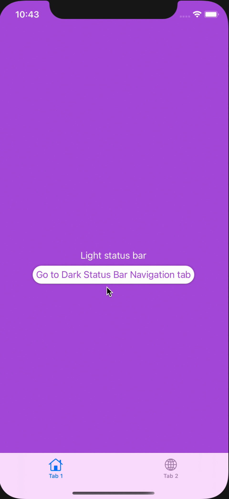

# swiftui-statusbarstyle
Supports changing the Status Bar style with natural SwiftUI syntax.


The status bar changes based on the view. 

## Installation
Simply add the ```StatusBarController.swift``` file into your project.

## Usage
### With new SwiftUI App Lifecycle</h2>
In your ```@main``` App file, simply wrap your main view in a ```RootView```.

```swift
@main
struct ProjectApp: App {     
    var body: some Scene {
        WindowGroup {
            //wrap main view in RootView
            RootView {
                //Put the view you want your app to present here
                ContentView()
                    //add necessary environment objects here 
            }
        }
    }
}
```

### With AppDelegate / SceneDelegate Lifecycle
In your ```SceneDelegate.swift```, in your```scene(_ scene: UIScene...)``` function, simply wrap your main view in a ```RootView```. 
```swift
class SceneDelegate: UIResponder, UIWindowSceneDelegate {

    var window: UIWindow?

    func scene(_ scene: UIScene, willConnectTo session: UISceneSession, options connectionOptions: UIScene.ConnectionOptions) {

        //wrap main view in RootView
        let contentView = RootView {
            //Put the view you want your app to present here
            ContentView()
                //add necessary environment objects here 
        }

        //Rest of function is unchanged 
        if let windowScene = scene as? UIWindowScene {
            let window = UIWindow(windowScene: windowScene)
            window.rootViewController = UIHostingController(rootView: contentView)
            self.window = window
            window.makeKeyAndVisible()
        }
    }
    
    //rest of default SceneDelegate goes unchanged...
}
```

### Example
Use the ```.statusBarStyle(_ style: UIStatusBarStyle)``` method on a View.
```swift
struct ContentView: View {
    var body: some View {
        TabView {
            //Tab  1 will have a light status bar
            Color.black
                .edgesIgnoringSafeArea(.all)
                .overlay(Text("Light Status Bar").foregroundColor(.white))
                .statusBarStyle(.lightContent) //set status bar style here
                .tabItem { Text("Tab 1") }
            
            //Tab 2 will have a dark status bar
            Color.white
                .edgesIgnoringSafeArea(.all)
                .overlay(Text("Dark Status Bar"))
                .statusBarStyle(.darkContent) //set status bar style here
                .tabItem { Text("Tab 2") }
        }
    }
}
````

